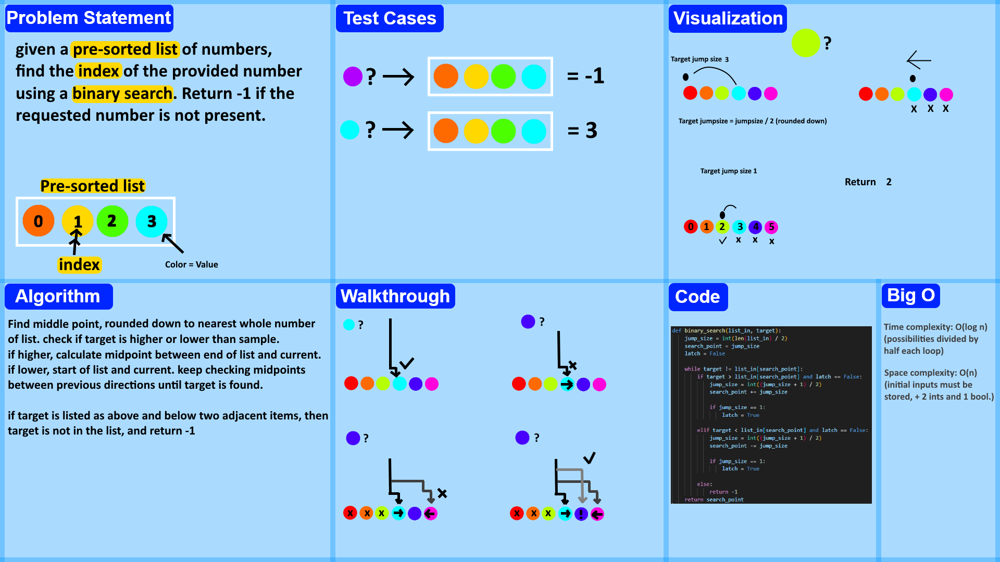

# Binary search in a sorted 1D array
<!-- Description of the challenge -->
Write a program that will perform a binary search in a sorted array that is already known to be in numerical order.
## Whiteboard Process
<!-- Embedded whiteboard image -->

## Approach & Efficiency
<!-- What approach did you take? Why? What is the Big O space/time for this approach? -->
After lots of frustration, I opted to use an always halving "jumper" where I jump half the length
of the array, and check current index for match, higher, or lower. if not found, jumper's value halves,
and it moves again across the list this halved amount of spaces. If a "jumpsize" of 1 is seen twice
(achieved with a latch) that means that our number is simply not present in the array, and so returns -1.
## Solution
<!-- Show how to run your code, and examples of it in action -->
```
def binary_search(list_in, target):
    jump_size = int(len(list_in) / 2)
    search_point = jump_size
    latch = False

    while target != list_in[search_point]:
        if target > list_in[search_point] and latch == False:
            jump_size = int((jump_size + 1) / 2)
            search_point += jump_size

            if jump_size == 1:
                latch = True

        elif target < list_in[search_point] and latch == False:
            jump_size = int((jump_size + 1) / 2)
            search_point -= jump_size

            if jump_size == 1:
                latch = True

        else:
            return -1
    return search_point
```
some logging from when I was testing the program:
```
initial search point is 6, has a value of 87
target higher, searching 9 jumpsize is 3
target higher, searching 11 jumpsize is 2
target lower, searching 10 jumpsize is 1
not present!
```
