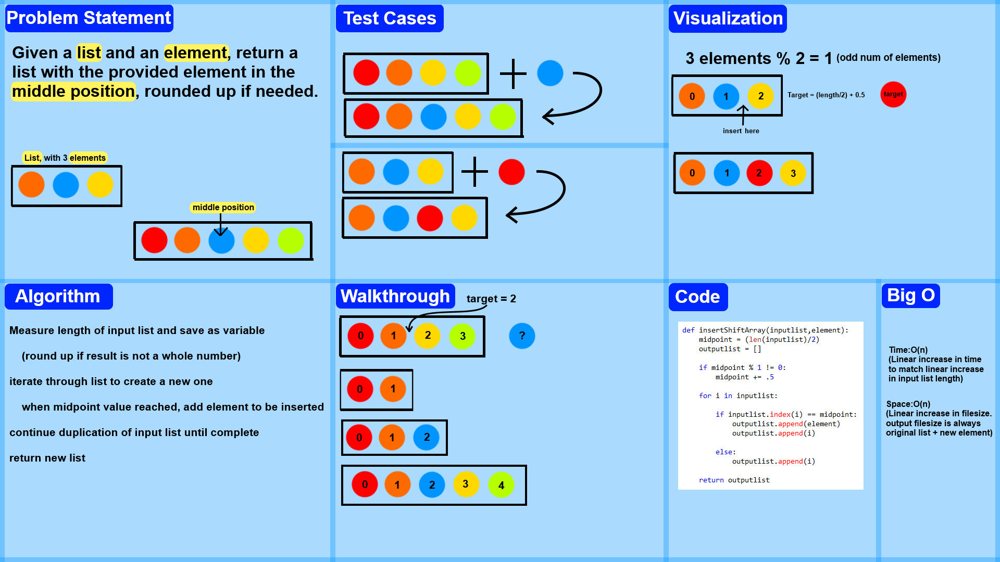

# Insert and shift an array in middle at index
<!-- Description of the challenge -->
Write a function called insertShiftArray which takes in an array and a value to be added. Without utilizing any of the built-in methods available to your language, return an array with the new value added at the middle index.

## Whiteboard Process
<!-- Embedded whiteboard image -->

## Approach & Efficiency
<!-- What approach did you take? Why? What is the Big O space/time for this approach? -->
I calculated and saved the target position (the index the new element should have) and created a new list by iterating over the input list, but inserting the new element when the iterator reaches the target position calculated earlier.

Once this is done, the program continues to append values to the end of the new list until the loop is complete, and then returns this new list.

The big o for both space and time is linear, as the number of iterations needed matches the input list's number of elements +1, and likewise, the space required is also that of the original, plus the inserted element.


## Solution
<!-- Show how to run your code, and examples of it in action -->
```
def insertShiftArray(inputlist,element):
	midpoint = (len(inputlist)/2)
	outputlist = []

	if midpoint % 1 != 0:
		midpoint += .5

	for i in inputlist:

		if inputlist.index(i) == midpoint:
			outputlist.append(element)
			outputlist.append(i)

		else:
			outputlist.append(i)

	return outputlist
```
