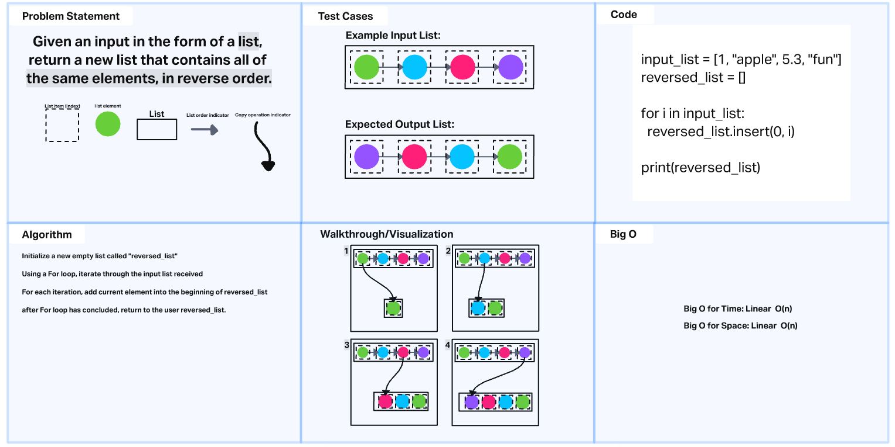

# Reverse an Array
<!-- Description of the challenge -->
Write a small module that takes an input in the form of a python list, and returns an output of the same list, in reverse order.


## Whiteboard Process
<!-- Embedded whiteboard image -->

## Approach & Efficiency
<!-- What approach did you take? Why? What is the Big O space/time for this approach? -->

Using the list.reverse() function in python felt like going against the spirit of the challenge, so I opted to  create a new list, and increment a for loop over an input list that duplicates each element into the start of the new list.

Because for loops start from index 0 and count up, copying each element into the first position of a new list will functionally reverse the input list.

## Solution
<!-- Show how to run your code, and examples of it in action -->

```
input_list = [1, "apple", 5.3, "fun"]
reversed_list = []

for i in input_list:
  reversed_list.insert(0, i)

print(reversed_list)
```
results in
```
['fun', 5.3, 'apple', 1]
```
