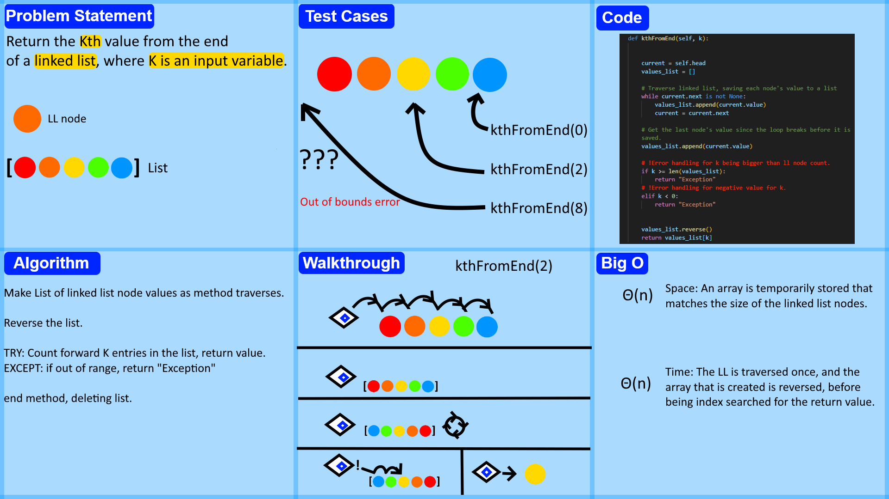

# kth From End
<!-- Description of the challenge -->
Extend the previously created linked_list.py to have a new method called ```kthFromEnd(k)``` This method should, when given a value for k, return the value of the node k number of steps back from the end of the list, and return the word Exception if an invalid, or out of bounds number is provided.

## Whiteboard Process
<!-- Embedded whiteboard image -->


## Approach & Efficiency
<!-- What approach did you take? Why? What is the Big O space/time for this approach? -->
I created a traverser to go through the linked list, placing every node value into a List as they are encountered. Upon the linked list end being reached, the array is then reversed, and the k value is used as the index of the list, which contains our value. Space wise, this creates a list with an index count matching the node count of the linked list, while time wise, it the linked list is traversed only once.

## Solution
<!-- Show how to run your code, and examples of it in action -->
linked_list.py contains the solution code, and can be run via ```python linked_list.py``` for a small print example showing the insert and includes methods are working correctly.

Pytest can be run in the data_structures directory to prove the passing of all tests present in test_linked_list.py.
