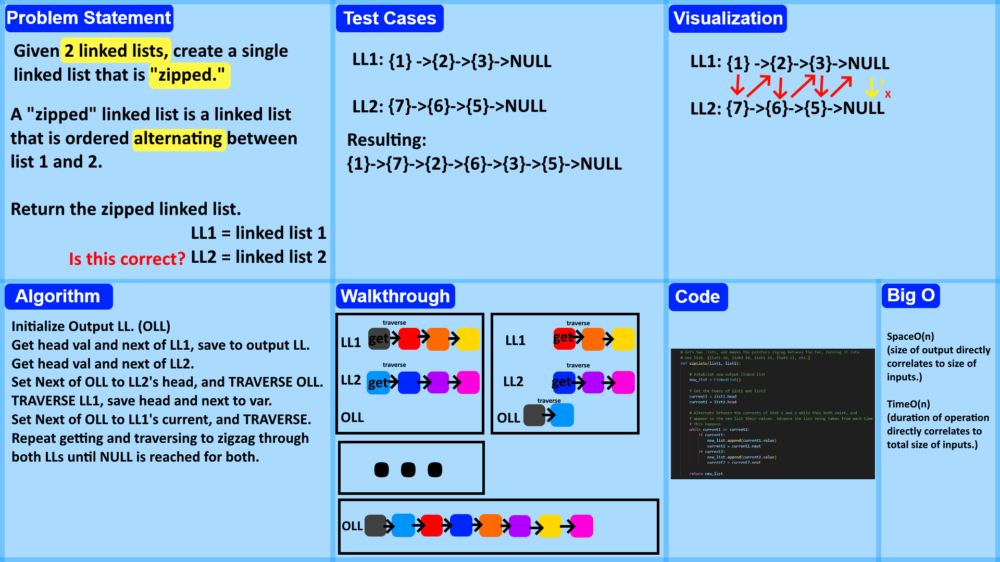

# Linked List Zip
<!-- Description of the challenge -->
Extend the previously created linked_list.py to have a new method called ```zipLists(list1, list2)``` which converts the two linked list into a single linked list, with the nodes alternating back and forth between list 1 and 2 (list1 index0, list2 index0, list1 index1, list2 index1...)

## Whiteboard Process
<!-- Embedded whiteboard image -->


## Approach & Efficiency
<!-- What approach did you take? Why? What is the Big O space/time for this approach? -->


## Solution
<!-- Show how to run your code, and examples of it in action -->
