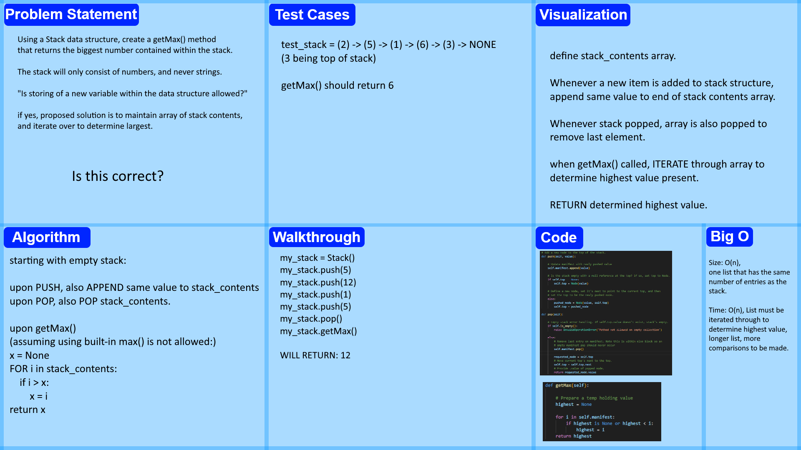

# Stack getMax
<!-- Description of the challenge -->
Using a stack as the underlying data structure, make a getMax() method that determines the largest number present in a stack. All stack input values will be numeric.
## Whiteboard Process
<!-- Embedded whiteboard image -->

## Approach & Efficiency
<!-- What approach did you take? Why? What is the Big O space/time for this approach? -->
I added in a list to the stack, that keeps track of all of the contents of the stack as they are added or removed. upon call of getMax(), iterate through the list, which contains all of the contents of the stack, and return the value determined to be highest in it.

## Solution
<!-- Show how to run your code, and examples of it in action -->
Code is available in stack.py located in the data structures folder, and proof of their function can be verified through pytest. The relevant tests are in python/tests/test_stack.py, at the bottom, each with the word "max" in them.
