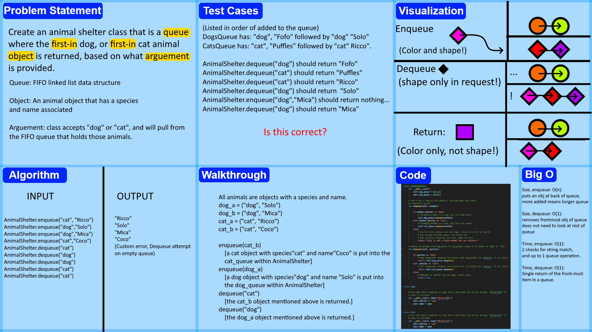

# Stack Queue Animal Shelter
<!-- Description of the challenge -->
"Create a class called AnimalShelter which holds only dogs and cats.
The shelter operates using a first-in, first-out approach."

The following methods must exist:
```
  enqueue(animal)
    animal is an object with a species property of either "cat" or "dog", and a name property.

  dequeue(pref)
    pref is short for preference, and can be either "dog" "cat" or, in the case of no input, return null.
      If pref is provided, return the first-most queued animal object of that type.
```


## Whiteboard Process
<!-- Embedded whiteboard image -->


## Approach & Efficiency
<!-- What approach did you take? Why? What is the Big O space/time for this approach? -->
I opted to create two separate queues, one for cats, and one for dogs, and do a simple string check to see which of the two the incoming animal belongs in. If the species matches "dog" then it goes into the dog queue. If the species matches "cat" it goes into the cat queue. If neither, return a string message saying that the input is invalid.

This approach is quite good in terms of big O, as the enqueue time, dequeue time, and dequeue space are all O(1). The only one that is not is the enqueue space, which is O(n), as each item added extends the length of the respective animal queue, so repeated enqueues will take up more and more space as animals are kept int the queues.


## Solution
<!-- Show how to run your code, and examples of it in action -->
The code cannot be run its own to any particular end, but pre-provided pytests show the proper functionality of the classes. running pytest in the directory that has stack_queue_animal_shelter.py proves that all provided tests are passing, and nothing prevents the usage of the AnimalShelter class according to specifications.
