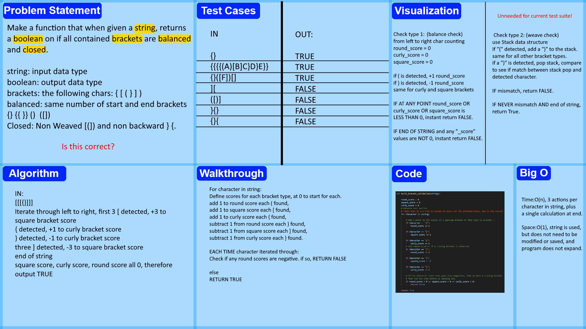

# Stack Queue Brackets
<!-- Description of the challenge -->
```
    Write a function called validate brackets
    Arguments: string
    Return: boolean representing whether or not the brackets in the string are balanced
```
brackets are the following 6 characters:
`{} () []`

balanced means that no brackets are open, and none are "interwoven" which means the following is *not* allowed to be returned as true:
```
[(])
} {
{{{}}}}
```
Any other characters are allowed to be present in the input string, will be ignored when bracket validation occurs, and have zero influence on the results of the boolean check.

## Whiteboard Process
<!-- Embedded whiteboard image -->


## Approach & Efficiency
<!-- What approach did you take? Why? What is the Big O space/time for this approach? -->

After talking about this problem with an associate, the idea of having a rolling counter for each bracket type, tracked from left to right, that increments when an open bracket appears, and decrements when a closed one does. Check these counters, and if they ever end up in negative, then there has been more closed brackets than open, which should never happen. return false. If at the end, the number is positive, then there have been more open brackets than closed, and so return false. If all bracket numbers end at 0, then they are balanced, but the matter of interwoven brackets is still unaddressed.

However, an issue presented itself with the testing system. Interwoven brackets are never actually checked for.

A stack system that adds a matching closing bracket when an open bracket is found, and pops for the sake of comparison when a closing bracket is found to see if the types match, would solve for if interwoven is present.

Current solution, that solves for the letter of the law tests provided, is O(n) time, and O(1) space, as it takes the first paragraph of this section's approach. Refined testing has been submitted, and I am open to reworking this assignment if I am expected to handle the missing edge cases.

## Solution
<!-- Show how to run your code, and examples of it in action -->
Code can not be run independently, but proof of function in accordance with provided tests can be verified with pytest.
Code is located in code_challenges/stack_queue_brackets.py
