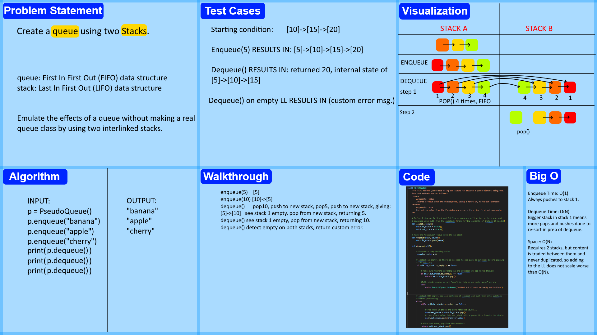

# Pseudo Queue
<!-- Description of the challenge -->
"Create a new class called pseudo queue.
Do not use an existing Queue.
Instead, this PseudoQueue class will implement our standard queue interface (the two methods listed below),
Internally, utilize 2 Stack instances to create and manage the queue"

## Whiteboard Process
<!-- Embedded whiteboard image -->

## Approach & Efficiency
<!-- What approach did you take? Why? What is the Big O space/time for this approach? -->
My approaches for a node-based stack are of a standard design, but for emulating a queue I opted to go with the "dequeue heavy" approach I had learned of from research on the internet, which also seems to be the intent of the assignment. This means that queuing is O(1) but dequeuing is O(N) worst case, as the in_stack may need to be popped one by one and pushed into the out_stack on dequeue request, before finally popping once from the out_stack. Size is O(N) always, as any time data is moved to the out_stack, it is first removed from the in_stack, using a single holding variable as temporary storage.

## Solution
<!-- Show how to run your code, and examples of it in action -->
Code is available in stack.py located in the data structures folder, and proof of function can be verified through pytest. The relevant tests are in python/tests/test_stack.py, at the bottom. Tests are self made, and check for function of a queue and dequeue, a dequeue from empty, and for queuing twice, then dequeueing three times.
