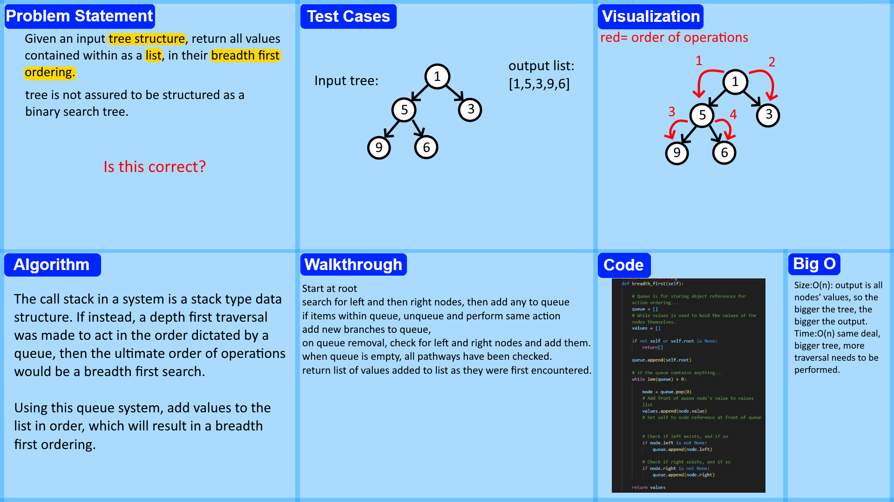

# Breadth First
<!-- Description of the challenge -->
Given a binary tree data structure, (not assured to be a binary search tree) Return a list of all nodes, ordered by a breadth first search method.

## Whiteboard Process
<!-- Embedded whiteboard image -->

## Approach & Efficiency
<!-- What approach did you take? Why? What is the Big O space/time for this approach? -->
while loop, and a faked queue using a list and pop. Traversal deeper is performed when an item is removed from the queue, doing the opposite of a depth first, and stack based recursive function would.

## Solution
<!-- Show how to run your code, and examples of it in action -->
Code is in binary_tree.py, and can be confirmed of function via the use of pytest. The relevant tests are located in test_tree_breadth_first.py.

Please note however that due to a misunderstanding on where my work should have been performed, I required TA assistance, and a reformatted pytest. The concepts are all solid, but I did my work as an extension of binary_tree.py, and not a separate function in a standalone file.
