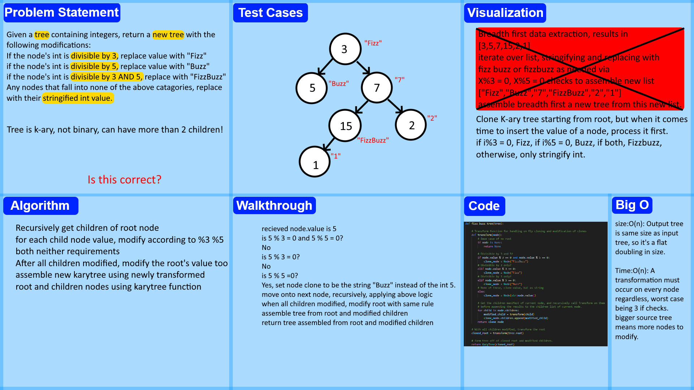

# Tree Fizz Buzz
<!-- Description of the challenge -->
Given an input K-ary tree, return a new K-ary tree with the following modifications:

if input node's value is divisible by 3, new node's value should be "Fizz"

if input node's value is divisible by 5, new node's value should be "Buzz"

if input node's value is divisible by 3 AND 5, new node's value should be "FizzBuzz"

Otherwise, node's value should be converted from int to string.

Return assembled new k-ary tree modified under these rules.

## Whiteboard Process
<!-- Embedded whiteboard image -->

## Approach & Efficiency
<!-- What approach did you take? Why? What is the Big O space/time for this approach? -->
Recursive modification of children, with a check for divisibility through 3 if/elif conditionals, then modification of the root under the same algorithm, and finally assembly via the KaryTree class.
Size and Time are both O(n), but time is variable depending on how many elifs need to be traversed per node. Since size of the output tree is matching with the size of the input tree (minus small changes due to a single int being replaced with a 8 character string) size is almost perfectly identical with input's.

## Solution
<!-- Show how to run your code, and examples of it in action -->
Code can be viewed at tree_fizz_buzz.py inside of the code_challenges directory. Proof of function as expected can be performed by running pytest. relevant tests are in the file test_tree_fizz_buzz.py
