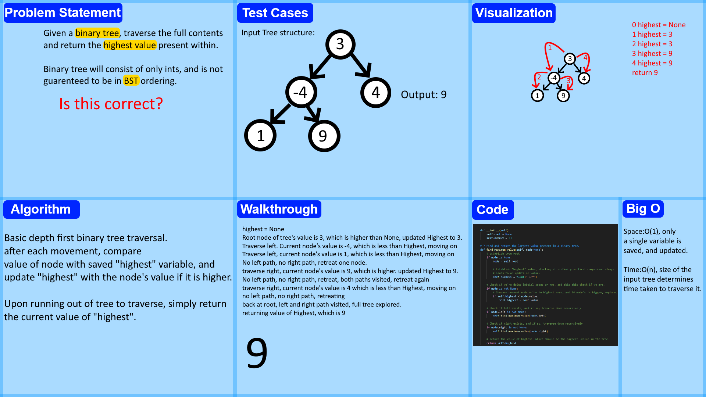

# Tree Max
<!-- Description of the challenge -->
Given a binary tree data structure, (not assured to be a binary search tree) find the highest value present, and return it. Assume tree contains only numerical values.

## Whiteboard Process
<!-- Embedded whiteboard image -->

## Approach & Efficiency
<!-- What approach did you take? Why? What is the Big O space/time for this approach? -->
Recursive function, and saving of all values encountered. Traverse the full contents of the tree, each time saving the bigger value to our "current_highest" when we encounter a value that is the highest we've seen.

Space is O(1), as a single value is being updated as the tree is traversed, time is O(n), where the bigger the tree is, the longer it takes to fully navigate to confirm the current number "held" is indeed the biggest present.

## Solution
<!-- Show how to run your code, and examples of it in action -->
Code is in binary_search_tree.py, and can be confirmed of fucntion via the use of pytest, the test_tree_max.py segment.
